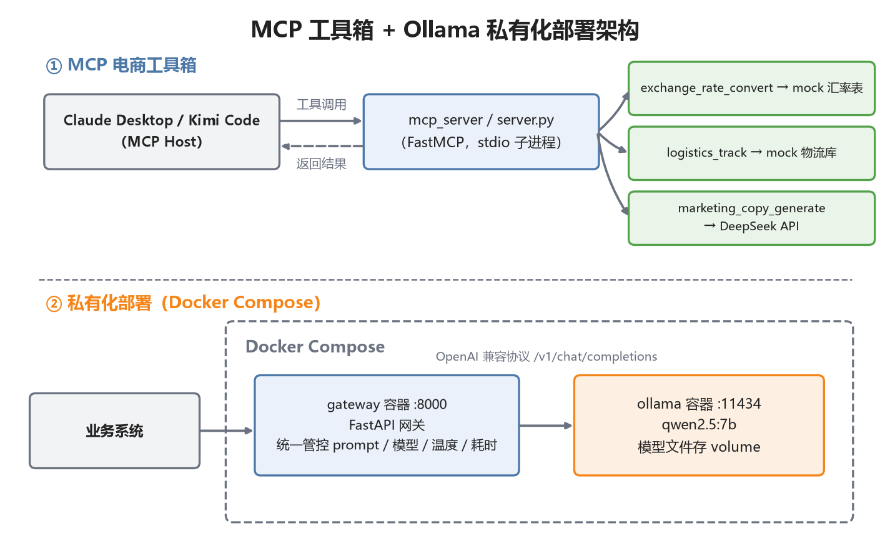

# MCP Server 与大模型私有化部署

两部分内容：

1. **"电商工具箱" MCP Server**：基于 MCP 官方 Python SDK（FastMCP）实现，向大模型客户端暴露 3 个工具——汇率换算、物流轨迹查询、营销文案生成，已接入 Claude Desktop 和 Kimi Code。
2. **Ollama 私有化方案**：Docker Compose 一键编排 Ollama + FastAPI 业务网关，OpenAI 兼容协议对外提供统一 /ask 接口，模型版本与 system prompt 服务端统一管控。

## 功能特性

- **三个 MCP 工具**：汇率换算（mock 汇率表）、物流轨迹（mock 单号）、营销文案（真实调 DeepSeek，无 key 时自动降级为模板输出，离线也能演示）
- **工具工程化**：工具与协议层分离（业务函数可独立单测）、docstring 即工具说明书、参数防御性校验
- **私有化网关**：/health 健康检查 + /ask 业务问答，业务方只传一句话，system prompt、模型、温度全在服务端管控
- **云端 + 本地混合架构**：同一套 openai SDK 代码，改 base_url 即在 DeepSeek 与本地 qwen 之间切换

## 实测数据

用 MCP Python 客户端以 stdio 方式拉起 server，走完整协议握手（initialize → tools/list → tools/call），与 Claude Desktop / Kimi Code 接入是同一条链路：

| 检查项 | 结果 |
|---|---|
| 协议握手 + 工具发现 | 3/3 |
| 汇率换算 29.99 USD→CNY | 通过，1ms（确定性工具） |
| 物流轨迹 YT10001 | 通过，1ms（确定性工具） |
| 营销文案（真实 LLM） | 通过，12~22s 出稿 |
| Ollama 网关 /health | up，正确识别模型 |
| Ollama 网关 /ask（CPU 推理） | 完整往返 36.3s（qwen3.5:4b 含思考链） |

完整明细与复现命令见 [评测报告.md](评测报告.md)。

## 技术栈

| 部分 | 技术 |
| --- | --- |
| MCP Server | Python 3.12、mcp（FastMCP）、openai SDK（DeepSeek） |
| 私有化部署 | Ollama、FastAPI + uvicorn、Docker Compose |
| 接入客户端 | Claude Desktop、Kimi Code CLI |

## 架构图



*图：上半部分为 MCP 电商工具箱（Host 通过 stdio 调用 FastMCP 三个工具），下半部分为 Docker Compose 私有化部署（FastAPI 网关 → Ollama 本地模型）。*

客户端侧看到的工具名形如 `mcp__ecommerce-toolbox__logistics_track`，即 `mcp__<server名>__<工具名>` 的命名规则；由模型判断需要工具时自动发起调用。

## 快速开始

1. 安装依赖：

```bash
pip install -r requirements.txt -i https://pypi.tuna.tsinghua.edu.cn/simple
```

2. 自测三个工具（不需要任何客户端、不需要 key）：

```bash
python mcp_server/server.py --self-test
```

3. 接入客户端：

- Claude Desktop：按 `docs/01-MCP接入ClaudeDesktop与KimiCode.md` 第一节改 `claude_desktop_config.json`；
- Kimi Code：同文档第二节，把配置写进 `C:\Users\你的用户名\.kimi-code\mcp.json`，`kimi` 里 `/mcp` 看连接状态；
- 接入后对它说："单号 YT10001 的包裹到哪了？"、"29.99 美元合多少人民币？"，看模型自动调工具。

4. 私有化部署（需 Docker Desktop）：

```bash
docker compose up -d --build
docker exec -it ollama ollama pull qwen2.5:7b
curl http://localhost:8000/health
curl -X POST http://localhost:8000/ask -H "Content-Type: application/json" -d "{\"question\":\"用三句话介绍海外仓模式\"}"
```

本地不用 Docker 的手工路线见 `docs/02-Ollama私有化部署与FastAPI封装.md`。

## 设计要点

**docstring 是工具最重要的部分。** 它是模型决定"调不调、怎么传参"的唯一依据，必须写清触发场景（"当用户询问……时使用"）和每个参数的含义。返回给模型的内容也要精炼、结构化——它会占用上下文，出错时返回有用的提示文本而不是抛异常。

**为什么私有化还要包一层 FastAPI？** 和"不把数据库直接暴露给前端"一个道理：业务方只传 question，模型名、system prompt、温度服务端统一管控；底层换模型或换推理引擎（Ollama 换 vLLM）业务零改动；鉴权、限流、审计、混合路由将来都加在这层。

**OpenAI 兼容协议的价值。** DeepSeek、通义、智谱、Kimi、Ollama、vLLM 都提供 OpenAI 兼容端点，一套 SDK 代码改两个参数就能在云端和本地模型间切换——这是"模型可替换性"的基础，也是混合路由（敏感数据走本地、复杂任务走云端）能成立的前提。

**本地 7B 和云端 API 怎么选。** 格式规整、模式固定的任务（摘要、分类、模板回复）7B 够用且数据不出内网；复杂推理、长文案本地模型明显吃力。实际方案是网关按任务复杂度分流。思考模型的思考链在 CPU 上可能很长，网关超时参数要和模型、硬件联动评估。

## 已知限制

- 汇率、物流是 mock 数据；接真实 API 只需替换 tools_*.py 中的数据层，接口不变
- MCP Server 仅演示 stdio 本地接入，团队共享应改 HTTP 部署并加鉴权
- 网关未实现流式输出（可用 StreamingResponse 转发 Ollama SSE 扩展）
- 未做高可用（生产需多副本 + 负载均衡 + 模型预热）

## 目录结构

```
├── docker-compose.yml                # ollama + gateway 一键编排
├── Dockerfile                        # FastAPI 网关镜像
├── mcp_server/                       # MCP Server：电商工具箱
│   ├── server.py                     #   入口：FastMCP 注册 3 个工具（含 --self-test）
│   ├── tools_exchange.py             #   工具1：汇率换算（mock 汇率表）
│   ├── tools_logistics.py            #   工具2：物流轨迹查询（mock 单号）
│   └── tools_copywriting.py          #   工具3：营销文案生成（真实调 DeepSeek）
├── ollama_gateway/
│   └── app.py                        # FastAPI 业务网关（/health、/ask）
└── docs/
    ├── 01-MCP接入ClaudeDesktop与KimiCode.md   # 完整配置文档 + 排错清单
    └── 02-Ollama私有化部署与FastAPI封装.md     # 装Ollama→拉模型→兼容API→包网关
```
